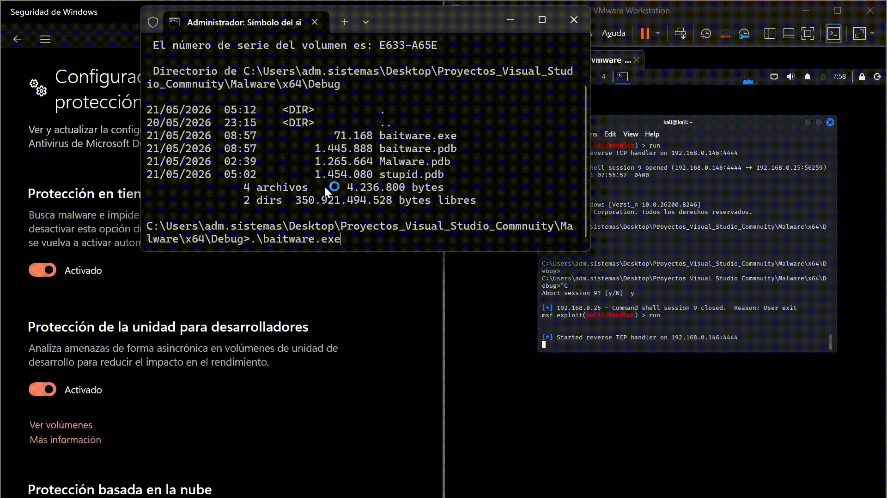

# BaitWare

> Educational malware development project for research and learning purposes only.

---
## PoC


## ⚠️ Disclaimer

This project is intended **strictly for educational and research purposes**. Use only in controlled lab environments with explicit authorization. The author is not responsible for any misuse or damage caused by this tool. Do not use against systems you do not own or have explicit permission to test.

---

## Description

BaitWare is a modular malware prototype built in C using the Windows API. It demonstrates a complete attack chain: persistence, payload retrieval, and shellcode execution via local thread hijacking — all in a clean, modular codebase designed for study and research.

The name comes from its core technique: a **bait function** is used as the sacrificial thread entry point, making the thread appear benign while the real payload executes through a hijacked instruction pointer.

---

## Attack Chain

```
1. Persistence    → copies itself to %LOCALAPPDATA%\Microsoft\WindowsApps\
                    registers in HKCU\...\Run for startup execution

2. Payload        → retrieves RC4-encrypted shellcode from the .rsrc section
                    decrypts it in memory at runtime

3. Execution      → creates a suspended sacrificial thread pointing to BaitFunction
                    hijacks the RIP register via GetThreadContext / SetThreadContext
                    resumes the thread to execute the payload
```

---

## Features

- **RC4 Encryption** — payload stored encrypted in the `.rsrc` PE section via `SystemFunction032` from `advapi32.dll`
- **RSRC Payload Storage** — shellcode embedded in the binary resource section, never touches disk as plaintext
- **Persistence** — copies itself to a legitimate-looking path and registers in the Run registry key
- **Local Thread Hijacking** — sacrificial suspended thread with RIP redirection, no new suspicious threads
- **Bait Function** — thread entry point points to a dummy function, making it appear benign
- **Process Enumeration** — uses `NtQuerySystemInformation` directly from NTDLL (no `CreateToolhelp32Snapshot`)
- **Modular architecture** — clean separation of concerns across multiple `.c`/`.h` modules

---

## Project Structure

```
BaitWare/
├── baitware.c          # Main entry point and attack chain orchestration
├── Baitfunction.c      # Sacrificial dummy thread function
├── Baitfunction.h
├── injector.c          # Thread hijacking and RC4 decryption
├── injector.h
├── obfuscation.c       # RC4 via SystemFunction032
├── obfuscation.h
├── payload.c           # RSRC payload retrieval
├── payload.h
├── persistence.c       # Self-copy and registry persistence
├── persistence.h
├── ThreadLocal.c       # Suspended thread creation
├── ThreadLocal.h
├── Malware.sln
└── Malware.vcxproj
```

---

## How It Works

### 1. Persistence
BaitWare copies itself to `%LOCALAPPDATA%\Microsoft\WindowsApps\updater.exe` and creates a registry value under `HKCU\Software\Microsoft\Windows\CurrentVersion\Run` so it executes on every user logon.

### 2. Payload Retrieval
The shellcode is stored RC4-encrypted in the `.rsrc` section of the PE. At runtime, `FindResource` → `LoadResource` → `LockResource` retrieves the raw bytes, which are copied to a heap buffer for decryption.

### 3. Thread Hijacking
A sacrificial thread is created in suspended state pointing to `BaitFunction` — a dummy function that performs random arithmetic. The thread RIP register is redirected to the decrypted shellcode via `GetThreadContext` / `SetThreadContext`. When resumed, the thread executes the payload instead of the dummy function.

---

## Requirements

- Windows 10/11 x64
- Visual Studio 2019 or later with **Desktop development with C++** workload

---

## Building

1. Clone the repository
```bash
git clone https://github.com/0xgu1/BaitWare.git
```

2. Open `Malware.sln` in Visual Studio

3. Set configuration to `Debug` / `x64`

4. Build with `Ctrl + Shift + B`

---

## Preparing the Payload

Generate a raw shellcode file and encrypt it with RC4 using the same key defined in `payload.c`, then embed it in the `.rsrc` section via `Resource.rc`:

```
IDR_RCDATA1 RCDATA "encrypted.bin"
```

---

## References

- [GetThreadContext - MSDN](https://learn.microsoft.com/en-us/windows/win32/api/processthreadsapi/nf-processthreadsapi-getthreadcontext)
- [SetThreadContext - MSDN](https://learn.microsoft.com/en-us/windows/win32/api/processthreadsapi/nf-processthreadsapi-setthreadcontext)
- [NtQuerySystemInformation - MSDN](https://learn.microsoft.com/en-us/windows/win32/api/winternl/nf-winternl-ntquerysysteminformation)
- [FindResource - MSDN](https://learn.microsoft.com/en-us/windows/win32/api/winbase/nf-winbase-findresourcea)
- [Maldev Academy](https://maldevacademy.com)

---

## Author

**0xgu1** — learning malware development for defensive research purposes.
